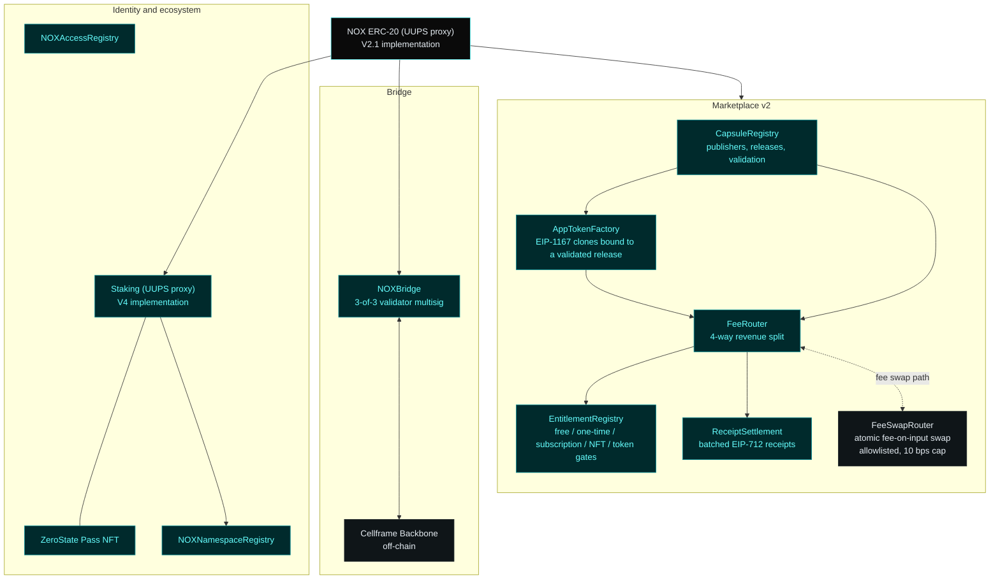
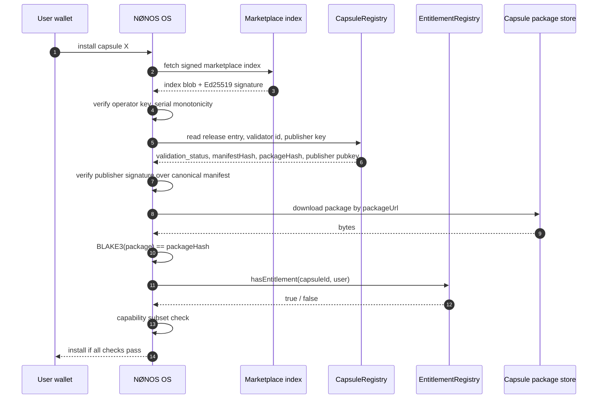

# Architecture

NOX is the asset of account for the NØNOS ecosystem. It bridges between
Ethereum and Cellframe Backbone, anchors a stake-backed identity layer, and
settles the capsule marketplace. The contract suite is split into five
concerns that talk to each other through small, fixed interfaces.

## System overview

## Identity model

A capsule app has three identifiers, all stored on-chain in `CapsuleRegistry`.

`capsuleId` — a 32-byte value derived deterministically from the publisher
public key, the package hash, the app namespace, and the major version. Stays
constant across releases of the same app.

`releaseId` — incrementing per capsule. One row in `capsule_releases` per
release. Carries the `manifestHash`, `packageHash`, `packageUrl`, and the
publisher's signature over the canonicalised manifest.

`appToken` — optional. If a publisher chooses to launch an app-bound token,
`AppTokenFactory.createAppToken(capsuleId, releaseId, manifestHash, packageHash, ...)`
deploys a fresh `AppBondingToken` clone whose `getAppToken()` view permanently
links the token back to the release that birthed it.

## Trust path

If any step fails, the install does not proceed. The marketplace publishes
the catalog; the OS is the final word on whether anything actually runs.

## Revenue model

Every NOX flow lands in `FeeRouter`. Each source identifier (`bytes32`) maps
to a `Profile` with four basis-point splits:

| Source profile | Publisher | NFT holders | Stakers | Treasury |
|---|---|---|---|---|
| trade | configurable | configurable | configurable | configurable |
| launch | 0 | configurable | configurable | configurable |
| unlock | configurable | configurable | configurable | configurable |
| receipt | configurable | configurable | configurable | configurable |

All profiles are role-controlled. Sums must equal 10000 bps. Rounding goes to
treasury. Default deployment routes everything to the DAO wallet as a single
sink, until the DAO votes to split.

## Upgradeability

| Contract | Pattern | Upgrader |
|---|---|---|
| NOX token | UUPS proxy at `0x0a26c80B…9eCA`, V2.1 implementation `0xBf0415eb…44e43` | 3-of-5 Safe |
| NOX Staking | UUPS proxy at `0xa94d6009…3613`, V4 implementation `0x415790B1…5B63` | 3-of-5 Safe |
| NOXBridge | UUPS proxy | bridge admin |
| CapsuleRegistry | UUPS proxy | dedicated UPGRADER role |
| AppTokenFactory | UUPS proxy | dedicated UPGRADER role |
| FeeRouter | UUPS proxy | dedicated UPGRADER role |
| EntitlementRegistry | UUPS proxy | dedicated UPGRADER role |
| ReceiptSettlement | UUPS proxy | dedicated UPGRADER role |
| NOXNamespaceRegistry | not upgradeable | none |
| NOXAccessRegistry | not upgradeable | none |
| AppBondingToken | per-clone immutable | clones get the new code only on factory upgrade for *new* clones |
| ZeroState Pass NFT | not upgradeable | none |

## Inputs and outputs across the system boundary

Three things enter the OS from this repo, and only three:

1. The signed marketplace index (binary, served at
   `/api/v1/marketplace/index`, signed by the operator key).
2. The result of `EntitlementRegistry.hasEntitlement(capsuleId, user)` queried
   on-chain.
3. The capsule package itself, downloaded from `packageUrl`, hash-checked.

Three things leave the OS toward this repo, and only three:

1. EIP-712 receipts signed by the user wallet, batched by the publisher's
   backend, settled in `ReceiptSettlement.batchSettle`.
2. Unlock transactions when the user buys access, calling
   `EntitlementRegistry.unlock(capsuleId)`.
3. Trades on `AppBondingToken` clones via the dapp.

The OS does not read marketplace policy, prices, or validator decisions
beyond the signed catalog. The marketplace does not read kernel internals.
