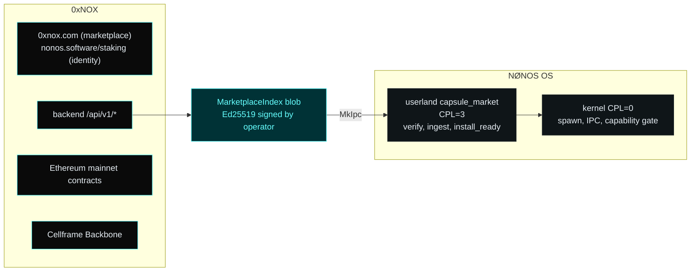

# 0xNOX dapp ↔ NØNOS OS — boundary

This document draws the line between two systems that are intentionally kept separate. Public copy must respect it; any claim that conflates them is wrong.

## Two systems, one product

**0xNOX** is the on-chain economic layer plus the web dapp at `https://0xnox.com`. It ships the NOX ERC-20 token, the staking contract with namespace + access registries, the bridge to Cellframe Backbone, the Uniswap V2 swap routing through `FeeSwapRouter`, the marketplace contracts (CapsuleRegistry, AppTokenFactory, AppBondingTokenV2, FeeRouter, EntitlementRegistry, ReceiptSettlement), and a backend at `/api/v1/*` that serves wallet/balance/marketplace data and produces the signed marketplace index. The staking and identity surface live at `https://nonos.software/staking/`.

**NØNOS OS** is a microkernel-direction operating system kept in a sibling
repository. The kernel runs at CPL=0; everything in `userland/` runs at CPL=3
as ELF binaries the kernel loads, isolates, and talks to over `MkIpc`. The
kernel knows nothing about NOX pricing, publisher identity, app-token
economics, or marketplace ranking. Marketplace policy lives in userland
(`capsule_market`) and on Ethereum.

The only thing that crosses this line is the signed marketplace index blob. The kernel never touches NOX, never reads chain state, never knows what an app token is. The dapp never spawns capsules, never installs packages, never talks to MkIpc.

## The signed marketplace index

The wire format lives at `userland/marketplace_abi/src/types/index.rs` and is the canonical contract between the two systems. The blob carries:

- `schema_version` — bumped on every wire-format change
- `operator_id` — the marketplace operator identifier (today: `nonos.marketplace.v1`)
- `operator_pubkey` — Ed25519 public key, 32 bytes; the OS-side capsule verifies the index against this and refuses anything signed by anyone else
- `published_at_ms` — Unix-millis snapshot timestamp
- `serial` — strictly increasing; the OS rejects any index whose serial is less than the last accepted one (rollback protection)
- `entries[]` — one `MarketplaceEntry` per listing, capped at `MAX_ENTRIES`
- `index_signature` — Ed25519 signature over the canonical bytes of the index up to (and excluding) this field

The OS side trusts a single operator key. Until that key is rotated, only the holder can produce an index the OS will accept. Operator key rotation is an OS-side and dapp-side coordination event.

## What is live today

| Layer | Component | State |
|---|---|---|
| 0xNOX | NOX ERC-20 + staking + ZeroState NFT | live on mainnet, source-verified |
| 0xNOX | Bridge (NOX ↔ Cellframe) | live, three-of-three validator multisig, donation/double-emit fixed and hardened with 12 defensive layers |
| 0xNOX | Swap (ETH ↔ NOX via Uniswap V2 + FeeSwapRouter) | live, single-popup model, FoT-aware, 0.10% protocol fee on chain |
| 0xNOX | App-token V2 contracts (factory + bonding token) | deployed, source-verified, factory proxy upgraded; launch gate `launchEnabled = false` until final dry-run + Safe rotation |
| 0xNOX | Marketplace base suite (CapsuleRegistry, FeeRouter, Entitlement, Receipts) | live on mainnet, source-verified, B33 single-key admin (disclosed) |
| 0xNOX | Backend `/api/v1/*` | live; `/swap/assets`, `/marketplace/apps`, `/bridge/*`, `/platform/stats`, `/dashboard/overview`, `/users/{addr}/holdings`, etc. all 200 |
| 0xNOX | Signed marketplace index endpoint | exists at `/api/v1/marketplace/index`; serves the binary form for OS consumption and a JSON form for the dashboard |
| OS | `capsule_market` userland capsule | implemented; smoke test `tests/boot/market_round_trip.sh` exists in the kernel tree |
| OS | Capsule install path (package fetch → manifest verify → publisher signature verify → arch-exact artifact → cap canonicalization → entitlement check → MkSpawn) | not public-live; gates per the kernel repository's public-claim gates document |

## Allowed public copy

The only language we use about marketplace + launch right now:

> Bridge and swap are live. App-token V2 infrastructure is deployed and source-verified. The V1 launch path is disabled at the contract layer. Public app-token launch remains gated while frontend routing, final dry-run, and admin/Safe posture are completed. Early privacy integration onboarding starts now.

What we do NOT say until proof exists:

- "Audited" — no external audit has been performed on any contract in the suite.
- "Public app install live" — the OS-side install path (package + manifest + signature + capability + spawn) has not been smoke-proven end-to-end in production.
- "App-token launch live" — `launchEnabled` on the live factory is currently `false`.
- "OS marketplace install live" — same gate as above.
- "Trustless XMR/BTC/SAL swaps" — those routes are external aggregator handoffs today, not native trustless swaps.
- "Fully production-ready" — the production-readiness spec lists gates (Safe rotation, final fork dry-run with deployed addresses, frontend post-graduation routing, OS install smoke) that are not all closed.

## Where each guarantee comes from

The kernel has its own public-claim gates document in the kernel repository. It is the source of truth for OS-side claims (microkernel surface, capability security, capsule isolation, etc.). The 0xNOX side has `docs/CONTRACT_REFERENCE.md` (this repo) for what each Solidity contract guarantees, `docs/DEPLOYMENTS.md` for live mainnet addresses and configuration, and `docs/SECURITY.md` for the per-contract review state.

When in doubt about whether a public claim crosses the line, the rule is: if the assertion talks about chain state, it's grounded in this repo; if it talks about runtime behaviour of installed apps, it's grounded in the kernel repo. If it talks about both, it must be backed by *both* repos and broken into the two distinct claims.
